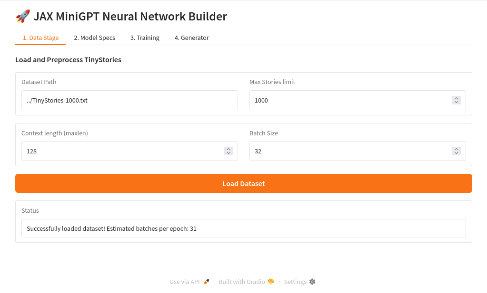
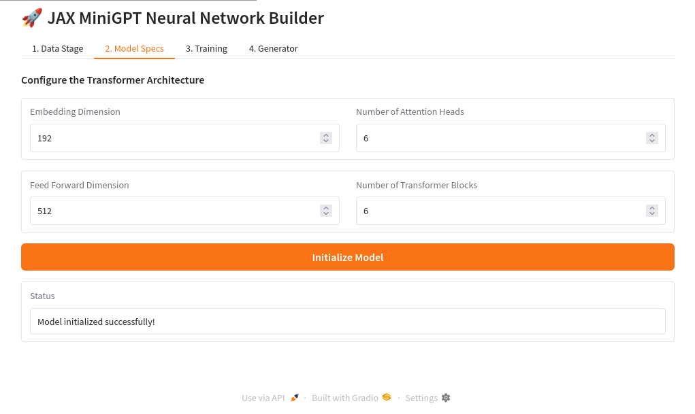
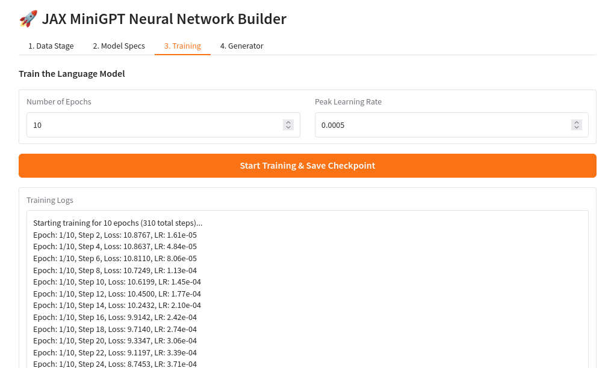
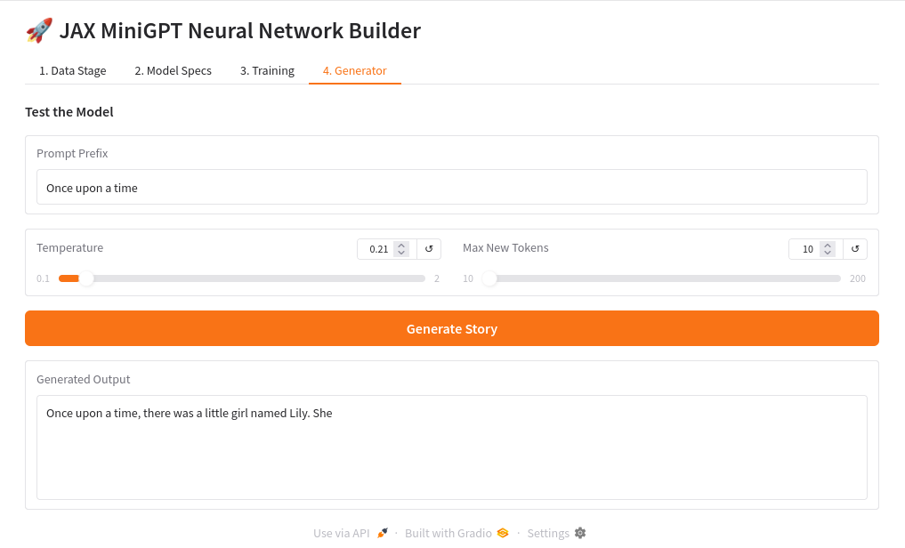

# MiniGPT built with JAX, Flax, and PyGrain 🚀

An educational implementation of a miniature GPT language model trained from scratch on the `TinyStories` dataset. 

This project is derived from **DeepLearning.AI's** interactive course materials on JAX, but has been heavily modernized and refactored to comply with the latest standard `flax.nnx` API architecture and `grain.python` data loaders.

## Interactive Gradio Web GUI 🖥️
We use Gradio to visually modularize the four stages of transformer lifecycle management:

### 1. Data Stage


### 2. Model Specs


### 3. Training Loop


### 4. Text Generator


## What's Inside?
- `helper.py`: Defines the `MiniGPT` Model architecture, `TransformerBlock`, and `pygrain` dataset loaders.
- `train.py`: A standalone, JIT-compiled training script equipped with an `optax.warmup_cosine_decay_schedule` and `orbax.checkpoint` serialization.
- `app.py`: A fully-featured **Gradio Web GUI**! Run this to instantly launch a 4-tab dashboard where you can customize hyperparameters, trigger training, view live loss logs, and generate native text from your learned checkpoints dynamically.

## The NNX Refactor (Why this fork exists)
The original course materials were built to run purely in a notebook using an earlier alpha version of `flax.nnx`. As the framework rapidly evolved, several breaking changes were introduced affecting how Neural Network representations are traced and successfully compiled by JAX. 

This repository fixes the following core issues to bring the codebase up to modern production standards:

1. **Module State Tracking (`nnx.List` & `nnx.data`)**: Standard Python lists are no longer safely tracked by Flax during JIT compilation. The `TransformerBlock` layers within the `MiniGPT` neural network have been explicitly wrapped in `nnx.List` and annotated with `nnx.data()` to ensure completely accurate architectural graph generation.
2. **Optimizer Encapsulation (`nnx.ModelAndOptimizer`)**: The previous standalone optimizer class became deprecated. We wrapped the base optimizer step within the requisite `ModelAndOptimizer` utility, which bundles model weights flawlessly with step variables for `orbax` binary saving.
3. **Globally Scoped JIT Compilation**: Moving the `@nnx.jit` training steps outside of the generic loop closures prevents JAX from repetitively re-compiling the cache hash on every execution frame. This squashes a huge memory leak and allows for continuous epoch training.

## Getting Started
### 1. Installation
This project requires Python 3.9+ and the libraries found in the parent requirements file.
```bash
pip install -r ../requirements.txt
```

### 2. Fetch the Data
Place the `TinyStories-1000.txt` sample dataset file inside the parent `../` directory (relative to these scripts).

### 3. Run the Web Interface
For the best interactive experience, start the Gradio App:
```bash
python app.py
```
This will launch a local web server (usually at `http://127.0.0.1:7860`) where you can adjust your context windows, initialize the exact model dimensions, press **Start Training**, and finally prompt your freshly minted language model!
